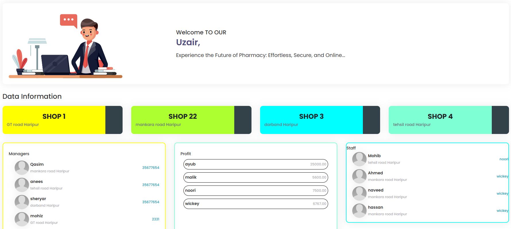
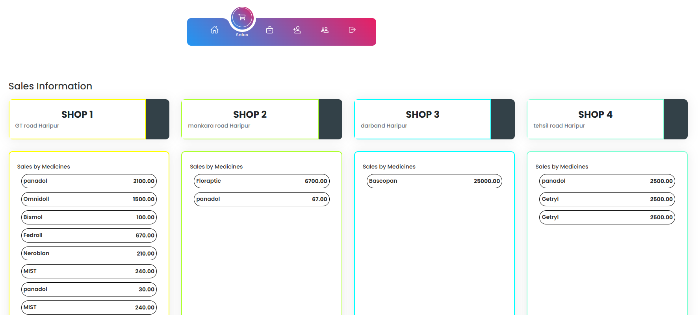
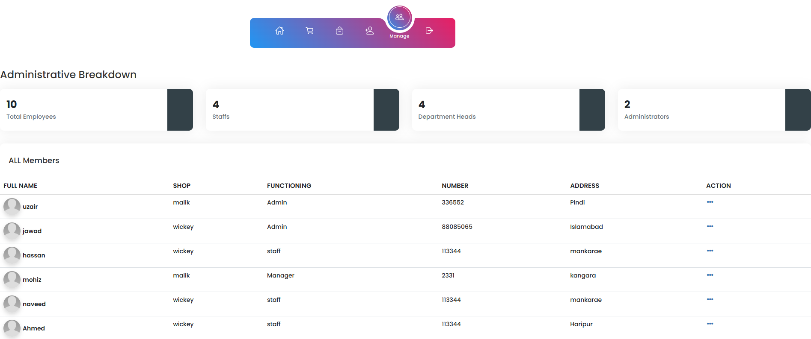
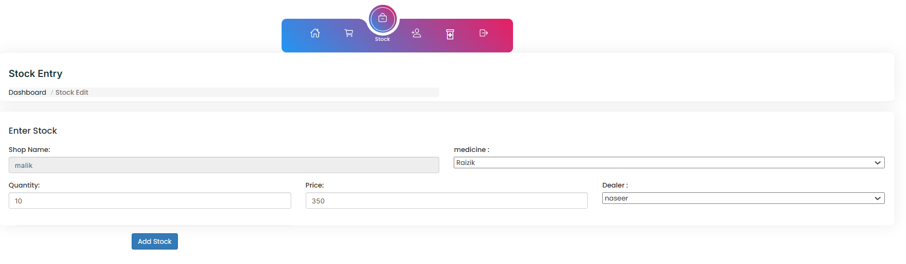
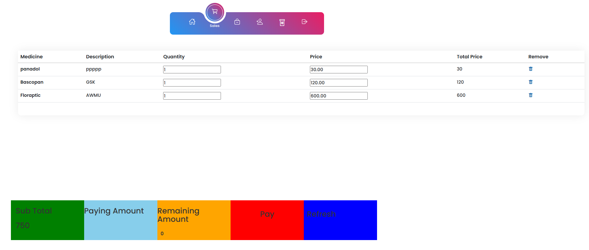

# 🏥 Database Project: Medical Store Website 🏥  

This project is a **web-based system** for managing multiple **medical stores**.  
- 🏪 **4 stores**, each managed by a **store manager**  
- 🏷️ **Admin** oversees all stores, monitoring **medicine stocks & sales data**  
- 📊 **GUI Interface** for easy data management  

---

## 📂 Project Overview  

- **User Roles:**  
  - **Admin:** Oversees all stores and reviews data  
  - **Store Managers:** Add, update, delete **medicine details**, manage **stocks & sales**  

- **Database:**  
  - Created in **MySQL** using **phpMyAdmin**  
  - Stores **medicine information, sales records, stock details**  

---
### Login Page


## Admin 
### Webapp Page 1 
  

### Webapp Page 2  
  

## Manager 
### Webapp Page 3


### Webapp Page 4


### Webapp Page 5


## ⚙️ Installation and Setup  

### 1️⃣ **Install XAMPP Server**  
First, download and install **XAMPP**.  

### 2️⃣ **Start Apache & MySQL**  
Open **XAMPP Control Panel** and **start**:  
✅ **Apache Server**  
✅ **MySQL**  

### 3️⃣ **Setup the Database**  
1. Open **Chrome** and go to:  
   ```sh
   localhost
